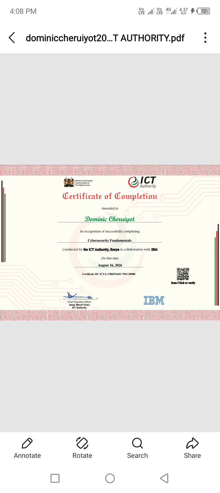

# Home Lab SOC Analyst Toolkit
By Dominic Cheruiyot | Kabarnet, Kenya | Aspiring SOC Analyst | Faulu Bank | Delmax

## Overview
Hands-on implementation of CIA Triad - Confidentiality, Integrity, Availability - for SOC Analyst L1 portfolio.

## 🛡️ Tools Included
- **Confidentiality.py** - AES-256 encryption / decryption lab (Protects data confidentiality)
- **Integrity.py** - SHA-256 file integrity monitoring (Detects tampering - SOC use case)
- **IR-playbook.md** - Incident Response Playbook for phishing, malware, data breach

## 📜 Certificate


Certified in Cybersecurity Fundamentals - ICT Authority Kenya

## 🎯 SOC Analyst Skills Demonstrated
- Encryption & Data Protection
- File Integrity Monitoring (FIM)
- Incident Response
- Python for Security Operations
- GitHub Portfolio Management

## How to Run
```bash
python Confidentiality.py
python Integrity.py
## Live Demo
https://dominiccheruiyot20-hue.github.io/Home-lab-SOC-Analyst-Toolkit-/

## SOC Analyst Home Lab
CIA Triad + IR Playbook + Python toolkit built on Termux